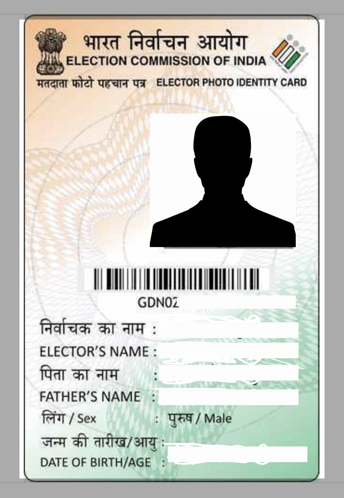
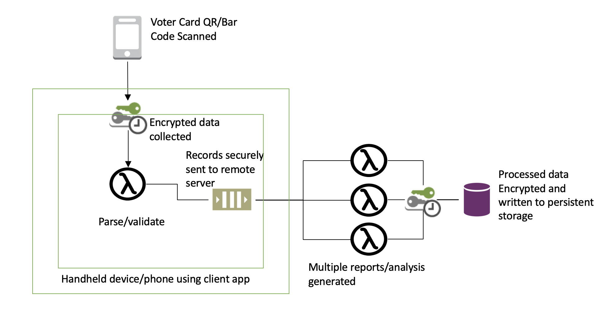

# My.Voting.Duty.Bill

### "Citizens Voting Duty Bill aka. My Voting Duty Bill"
<p align="left">
  
</p>
#
##  "Assemblies": ["Central", "State"]

``` This is a bill or resolution drafted for Central and State committee. ```




##  Features:
  * Getting to know citizens voting percentage demographic and staticals analysis to improve quality of voting in elections.
  
  * This will allow to collect only voter's first name, last name, constituency, voting location for analysis.
  
  * This will create additional verification system for EVMs and VVPAT.
  
  * There will not be any link to any primary goverment provided id number such as AadharCard or PAN..only voter registration number will be used
  
  * Collecting of registration number will be encrypted end to end and will not have any link.
  
  * Citizen can opt out to not share voter registration number.
    

